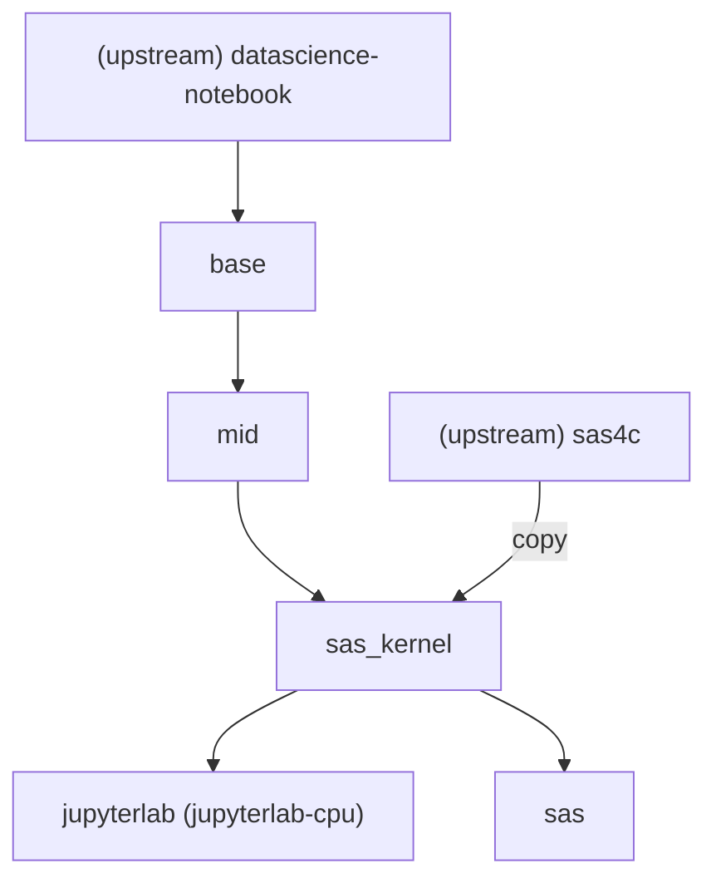

# Zone Kubeflow Containers

Custom Docker images for Jupyter-based data science notebooks on [The Zone](https://zone.statcan.ca).

> 🎯 **What is this?** This repository builds specialized Docker container images for Statistics Canada's "Zone" platform. These containers provide ready-to-use Jupyter environments with pre-installed data science tools, programming languages (Python, R, Julia), and specialized kernels (SAS). They're designed to make it easy for data scientists to get started with minimal setup.

---

## Table of Contents

- [Quick Start](#quick-start)
- [What's Included](#whats-included)
- [Project Structure](#project-structure)
- [Development Guide](#development-guide)
- [Testing](#testing)
- [Advanced Topics](#advanced-topics)
- [Resources](#resources)

---

## Quick Start

### Prerequisites
- Docker Desktop or Docker Engine installed
- Python 3.10+ (for development)
- Git

### Setup (5 minutes)

```bash
# 1. Clone the repository
git clone https://github.com/StatCan/zone-kubeflow-containers.git
cd zone-kubeflow-containers

# 2. Create development environment
make install-python-dev-venv

# 3. Build an image
make bake/base          # Start with the base image

# 4. Run it locally
make dev/base           # Opens http://localhost:8888 automatically
```

That's it! You now have a running Jupyter environment.

---

## What's Included

### 📦 Available Images

| Image | Purpose | Tools |
|-------|---------|-------|
| **jupyterlab-cpu** | Main data science environment | JupyterLab, Python, R, Julia, SAS Kernel, VS Code |
| **sas** | SAS-focused environment | Everything in jupyterlab-cpu + SAS Studio |
| **base** | Foundation layer | Python, Conda, Jupyter, basic tools |
| **mid** | Extended tools | VS Code, additional languages, custom kernels |

### 🔧 Technical Stack

- **Base**: [Jupyter Docker Stacks](https://github.com/jupyter/docker-stacks) (datascience-notebook)
- **Container Runtime**: Docker with BuildX for multi-platform builds
- **Languages**: Python 3, R, Julia
- **Kernels**: Python, R, SAS
- **IDEs**: JupyterLab, VS Code
- **Testing**: pytest with comprehensive integration tests

---

## Project Structure

```
zone-kubeflow-containers/
├── images/                    # Docker image definitions
│   ├── base/                 # Base image (foundation)
│   ├── mid/                  # Mid-tier image (extended tools)
│   ├── sas_kernel/           # SAS kernel integration
│   ├── jupyterlab/           # Final JupyterLab image
│   └── sas/                  # SAS Studio image
├── tests/                     # Automated test suite
│   ├── general/              # Tests for all images
│   └── jupyterlab-cpu/       # JupyterLab-specific tests
├── docker-bake.hcl           # Docker Bake configuration
├── Makefile                  # Build & test commands
└── requirements-dev.txt      # Python development dependencies
```

Each `images/*/` directory contains:
- `Dockerfile` — Build instructions
- Related configuration files (conda, pip configs, etc.)

---

## Development Guide

### Building Images

Images are built layer-by-layer, with each layer building on the previous:

```
upstream datascience-notebook
    ↓
  base       (adds conda packages, tools)
    ↓
  mid        (adds VS Code, kernel tools)
    ↓
  sas_kernel (adds SAS kernel)
    ↓
  jupyterlab-cpu  (final JupyterLab image)
  sas             (final SAS Studio image)
```

Build commands:

```bash
# Build a specific image
make bake/jupyterlab-cpu

# Build all images
make bake/base && make bake/mid && make bake/jupyterlab-cpu

# Build with custom base image
make bake/base BASE_IMAGE=quay.io/jupyter/datascience-notebook:2025-08-15

# Build for specific registry
make bake/base REPO=myregistry.azurecr.io
```

### Running Images Locally

```bash
# Interactive development (opens browser automatically)
make dev/jupyterlab-cpu

# Manual docker run
docker run -p 8888:8888 k8scc01covidacr.azurecr.io/jupyterlab-cpu:latest

# With custom notebook prefix
docker run -p 8888:8888 -e NB_PREFIX=/my-prefix k8scc01covidacr.azurecr.io/jupyterlab-cpu:latest
```

### Modifying Images

1. **Edit the Dockerfile** in `images/<image-name>/`
2. **Rebuild**: `make bake/<image-name>`
3. **Test**: `make test/<image-name>`
4. **Commit** and push

Example: Adding a Python package

```dockerfile
# In images/mid/Dockerfile
RUN conda install -c conda-forge \
    my-new-package
```

---

## Testing

### Quick Start

```bash
# Run all tests
make test

# Run only fast tests (skip slow integration tests)
make test-fast

# Run critical smoke tests
make test-smoke

# Generate coverage report
make test-coverage
```

### Test Types

| Test Type | Purpose | Markers |
|-----------|---------|---------|
| **Smoke** | Critical functionality (server startup, basic health) | `@pytest.mark.smoke` |
| **Integration** | Full container execution (kernel tests, package imports) | `@pytest.mark.integration` |
| **Slow** | Long-running tests (notebook execution, complex operations) | `@pytest.mark.slow` |

### What Gets Tested

- ✅ Container starts within 60 seconds
- ✅ Jupyter server responds to HTTP requests
- ✅ Environment variables correctly configured
- ✅ Python/R kernels can execute code
- ✅ Required packages can be imported
- ✅ System tools available (git, conda, pip, etc.)
- ✅ File I/O and permissions work
- ✅ No critical errors in startup logs

For detailed testing information, see [tests/README.md](./tests/README.md).

---

## Advanced Topics

### Adding New Software

Be selective—images are already 14-16GB. Consider:

1. **Is it used by many data scientists?** → Add to this repo
2. **Is it specialized/niche?** → Consider [aaw-contrib-containers](https://github.com/StatCan/aaw-contrib-containers)

**Process:**
1. Edit the appropriate Dockerfile in `images/`
2. Build and test: `make bake/<image> && make test/<image>`
3. Submit PR for review

### Creating New Images

1. Create directory: `mkdir images/my-image`
2. Create Dockerfile: `images/my-image/Dockerfile`
3. Add to `docker-bake.hcl` with proper parent image reference
4. Add GitHub Actions job to `.github/workflows/docker.yaml`
5. Create image-specific tests: `mkdir tests/my-image`

### Azure Container Registry (ACR)

```bash
# Login to ACR (required for push/pull)
az acr login -n k8scc01covidacr

# Pull existing image
docker pull k8scc01covidacr.azurecr.io/jupyterlab-cpu:latest

# Push image (after build)
make push/jupyterlab-cpu REPO=k8scc01covidacr.azurecr.io
```

### CI/CD Pipeline

GitHub Actions automatically:
- Builds images on push to `master` or `beta` branches
- Runs full test suite against each image
- Scans for security vulnerabilities (Trivy)
- Pushes to Azure Container Registry

Triggered on:
- Push to `master` or `beta`
- Pull requests with changes to `images/`, `tests/`, or workflow files

View workflow status: [Actions tab](https://github.com/StatCan/zone-kubeflow-containers/actions)

### Troubleshooting

**Port 8888 already in use:**
```bash
# Windows
netstat -ano | findstr :8888

# macOS/Linux
lsof -i :8888
```

**Image won't start:**
```bash
# Check Docker is running
docker ps

# View container logs
docker logs <container-id>

# Rebuild from scratch
make bake/jupyterlab-cpu
```

**Tests failing locally but not in CI:**
```bash
# Ensure dev environment is fresh
rm -rf .venv
make install-python-dev-venv

# Rebuild image
make bake/jupyterlab-cpu

# Run tests with verbose output
make test-v IMAGE_NAME=jupyterlab-cpu
```

---

## Resources

### Documentation
- 📖 [Zone User Documentation](https://zone.pages.cloud.statcan.ca/docs/en/)
- 📦 [Jupyter Docker Stacks](https://github.com/jupyter/docker-stacks)
- 🐳 [Docker Documentation](https://docs.docker.com/)
- 🔨 [Docker Bake Guide](https://docs.docker.com/build/bake/)

### Related Projects
- [aaw-contrib-containers](https://github.com/StatCan/aaw-contrib-containers) — Community-contributed images
- [The Zone](https://zone.statcan.ca) — Deployment platform

### Contributing
We welcome contributions! Please:
1. Create a feature branch
2. Make changes and test locally (`make test/my-image`)
3. Submit a pull request
4. Wait for CI/CD pipeline to pass

---

## Introduction

Our Container images are based on the community driven [jupyter/docker-stacks](https://github.com/jupyter/docker-stacks).
We chose those images because they are continuously updated and install the most common utilities.
This enables us to focus only on the additional toolsets that we require to enable our data scientists.
These customized images are maintained by the Zone team and are the default images available on The Zone.

## Overview of Images

Each directory in the images folder makes up one stage of the build process.
They each contain the Dockerfile that directs the build, and all related files.

The relationship between the stages and the final product is as shown below.


### Base Images

These images are chained together to perform the multi-staged build for our final images

Image | Notes
--- | ---
[base](./images/base) | Base Image pulling from docker-stacks
[mid](./images/mid) | Installs various tools on top of the base image
[sas-kernel](./images/sas_kernel) | Installs the SAS kernel on our mid image

### Zone Images

These are the final images from our build process and are intended to be used on Kubeflow Notebooks

Image | Notes | Installations
--- | --- | ---
[jupyterlab-cpu](./images/jupyterlab) | The base experience. A jupyterlab notebook with various | Jupyter, VsCode, R, Python, Julia, Sas kernel
[sas](./images/sas) | Similar to our jupyterlab-cpu image, except with SAS Studios | Sas Studios

## Usage

### Building Images

We have setup [Docker Bake](https://docs.docker.com/build/bake/) to help with building our images. Docker Bake lets us define our build configuration for our images through a file instead of CLI instructions.

To build an image, you can use either `make bake/IMAGE` or `docker buildx bake IMAGE`. `docker build` commands can still work if desired.

`make bake` accepts overrides for BASE_IMAGE, REPO and TAGS to adjust these values for the build.

To review any parameters for the image builds, you can review and edit the [docker-bake.hcl](./docker-bake.hcl) file. 
This file is currently setup for local development. We use parameter overrides for our github workflows to adjust the docker bake file for our CI/CD process.

**Note:** Our workflows save all our images in our Azure Container Registry. To pull and push to our ACR locally, 
you will first have to login using `az acr login -n k8scc01covidacr`

**Note:** `make push` by default does `docker push --all-tags` in order to push the SHA, SHORT_SHA, etc., tags.  

### Testing Images

#### Running and Connecting to Images Locally/Interactively

To test an image interactively, use `make dev/IMAGENAME`.
This calls `docker run` on a built image,
automatically forwarding ports to your local machine and providing a link to connect to.
Once the docker container is running, it will serve a localhost url to connect to the notebook.

#### Automated Testing

Automated tests are included for the generated Docker images using `pytest`.
This testing suite is modified from the [docker-stacks](https://github.com/jupyter/docker-stacks) test suite.
Image testing is invoked through `make test/IMAGENAME`
(with optional `REPO` and `TAG` arguments like `make build`).

Testing of a given image consists of general and image-specific tests:

```
└── tests
    ├── general                             # General tests applied to all images
    │   └── some_general_test.py
    └── jupyterlab-cpu                      # Test applied to a specific image
        └── some_jupyterlab-cpu-specific_test.py
```

Where `tests/general` tests are applied to all images,
and `tests/IMAGENAME` are applied only to a specific image.
Pytest will start the image locally and then run the provided tests to determine if Jupyterlab is running, python packages are working properly, etc.
Tests are formatted using typical pytest formats
(python files with `def test_SOMETHING()` functions).
`conftest.py` defines some standard scaffolding for image management, etc.

---

## General Development Workflow

### Running A Zone Container Locally

1. Clone the repository with `git clone https://github.com/StatCan/zone-kubeflow-containers`.
2. Run `make install-python-dev-venv` to build a development Python virtual environment.
2.5 Add back from statements in Dockerfiles.
3. Build your image using `make bake/IMAGENAME`,
e.g. run `make bake/base`.
4. Test your image using automated tests through `make test/IMAGENAME`,
e.g. run `make test/sas`.
Remember that tests are designed for the final stage of a build.
5. View your images with `docker images`.
You should see a table printed in the console with your images.
For example you may see:

```
username@hostname:~$ docker images
REPOSITORY                                  TAG        IMAGE ID       CREATED          SIZE
k8scc01covidacr.azurecr.io/jupyterlab-cpu   v2         13f8dc0e4f7a   26 minutes ago   14.6GB
k8scc01covidacr.azurecr.io/sas              v2         2b9acb795079   19 hours ago     15.5GB
```

7. Run your image with `docker run -p 8888:8888 REPO/IMAGENAME:TAG`, e.g. `docker run -p 8888:8888 k8scc01covidacr.azurecr.io/sas:v2`.
8. Open [http://localhost:8888](http://localhost:8888) or `<ip-address-of-server>:8888`.

### Testing locally

1. Clone the repo
2. Edit an image via the [image stages](/images) that are used to create it.
3. Build your edited stages and any dependencies using `make bake/IMAGENAME`
    * (optional) Run `docker pull REPO/IMAGENAME:TAG` to pull an existing version of the image you are working on 
    (this could be useful as a build cache to reduce development time below)
    * (optional) If the BASE_IMAGE is not build locally for the image stage you want to build, you will have to either run `make bake/BASE_IMAGE` to build it locally, 
    or you will have to pull the image.
4. Test your image:
    * using automated tests through `make test/IMAGENAME`
    * manually by `docker run -it -p 8888:8888 REPO/IMAGENAME:TAG`,
     then opening it in [http://localhost:8888](http://localhost:8888)

### Testing On-Platform

GitHub Actions CI is enabled to do building, scanning, automated testing, pushing of our images to ACR.
The workflows will trigger on the following:

- any push to master or beta
- any push to an open PR that edits files in `.github/workflows/` or `/images/`

This allows for easy scanning and automated testing for images.

After the workflow is complete,
the images will be available on artifactory.cloud.statcan.ca/das-aaw-docker.
You can access these images on https://zone.statcan.ca using any of the following:

- artifactory.cloud.statcan.ca/das-aaw-docker/IMAGENAME:BRANCH_NAME
- artifactory.cloud.statcan.ca/das-aaw-docker/IMAGENAME:SHA
- artifactory.cloud.statcan.ca/das-aaw-docker/IMAGENAME:SHORT_SHA

Pushes to master will also have the following tags:

- artifactory.cloud.statcan.ca/das-aaw-docker/IMAGENAME:latest
- artifactory.cloud.statcan.ca/das-aaw-docker/IMAGENAME:v2

### Adding new software

Software needs to be added by modifying the relevant image stage,
then following the normal build instructions starting with the Generate Dockerfiles step.

Be selective with software installation as image sizes are already quite big (16Gb plus),
and increasing that size would negatively impact the time it takes up for a workspace server to come up
(as well as first time image pulls to a node).
In such cases it may be more relevant to make an image under [aaw-contrib-containers](https://github.com/StatCan/aaw-contrib-containers) as mentioned earlier.

### Adding new Images

1. Identify where the new stage will be placed in the build order
2. Create a new subdirectory in the `/images/` directory for the stage
3. Add a new target to the `docker-bake.hcl` file for the new stage.
    ```
    # general format for a bake target
    target "stage-name" {
      args = {
        BASE_IMAGE="BASE_IMAGE"         # ARGS values from the dockerfile
      }
      context = "./images/stage-name"   # points to the location of the dockerfile
      tags = ["stage-name"]             # name given to the built docker image
    }
    ```
4. Add a new job to the `./github/workflows/docker.yaml` for the new stage.

    ```yaml
    # yaml to create an image
    stage-name:                                                         # The name of the stage, will be shown in the CICD workflow
      needs: [vars, parent]                                             # All stages need vars, any stages with a parent must link their direct parent
      uses: ./.github/workflows/docker-steps.yaml
      with:
        image: "stage-name"                                             # The name of the current stage/image
        directory: "directory-name"                                     # The name of the directory in the /images/ folder. /images/base would be "base"
        base-image: "quay.io/jupyter/datascience-notebook:2024-06-17"   # used if the stage is built from an upsteam image. Omit if stage has a local parent
        parent-image: "parent"                                          # The name of the parent stage/image. Omit if stage uses an upsteam image
        parent-image-is-diff: "${{ needs.parent.outputs.is-diff }}"     # Checks if the parent image had changes. Omit if stage uses an upsteam image
        # The following values are static between differnt stages
        registry-name: "${{ needs.vars.outputs.REGISTRY_NAME }}"
        branch-name: "${{ needs.vars.outputs.branch-name }}"
      secrets:
        REGISTRY_USERNAME: ${{ secrets.REGISTRY_USERNAME }}
        REGISTRY_PASSWORD: ${{ secrets.REGISTRY_PASSWORD }}
    ```

5. If this stage was inserted between two existing stages,
update the parent values of any children of this stage
6. If this stage creates an image that will be deployed to users.
A job must be added to test the image in `./github/workflows/docker.yaml`,
and the image name must be added to the matrix in `./github/workflows/docker-nightly.yaml`

    ```yaml
    # yaml to create a test
    imagename-test:                                       # The name of the test job, usually  imagename-test
      needs: [vars, imagename]                            # Must contain vars and the image that will be tested
      uses: ./.github/workflows/docker-pull-test.yaml
      with:
        image: "imagename"                                # The name of the image that will be tested
        # The following values are static between differnt tests
        registry-name: "${{ needs.vars.outputs.REGISTRY_NAME }}"
        tag: "${{ needs.vars.outputs.branch-name }}"
      secrets:
        REGISTRY_USERNAME: ${{ secrets.REGISTRY_USERNAME }}
        REGISTRY_PASSWORD: ${{ secrets.REGISTRY_PASSWORD }}
        CVE_ALLOWLIST: ${{ secrets.CVE_ALLOWLIST}}
    ```

7. Update the documentation for the new stage.
This is generally updating `images-stages.png` and `image-stages.drawio` in the `docs/images` folder using draw.io.

### Custom scripts

To manage our custom scripts that we want to execute after a container starts up, we use the [s6-overlay](https://github.com/just-containers/s6-overlay). Kubeflow upstream also uses this tool with their [example notebook servers](https://github.com/kubeflow/kubeflow/blob/master/components/example-notebook-servers/README.md#configure-s6-overlay)


Scripts that need to run during the startup of the container can be placed in `/etc/cont-init.d/`, and are executed in ascending alphanumeric order.

Scripts like our [start-custom](./images/mid/s6/cont-init.d/02-start-custom) use the with-contenv helper so that environment variables (passed to container) are available in the script.

Extra services to be monitored by s6-overlay should be placed in their own folder under `/etc/services.d/` containing a script called `run` and optionally a finishing script `finish`.

An example of a long-running service can be found in our [main run script](./images/mid/s6/services.d/jupyter/run) which is used to start JupyterLab itself.

#### Note on setting environment variables in startup scripts

When using both a startup script and a service script, environment variables declared in the startup script (using `export VAR=value` for example) will not be available in the service script.

To circumvent this limitation, if you need to declare new environment variables from a custom script, you can first create a custom environment location, like `/run/s6-env`. Then, you can store your new environment variables in that new location, using for example `echo ${TEST_ENV_VAR} > /run/s6-env/TEST_ENV_VAR`. 
Then, when executing the long-running service, you can use `s6-envdir /run/s6-env` to point to your custom environment location in the `exec` command.

### Modifying and Testing CI

If making changes to CI that cannot be done on a branch (eg: changes to issue_comment triggers), you can:

1. fork the 'kubeflow-containers' repo
2. Modify the CI with

- REGISTRY: (your own dockerhub repo, eg: "j-smith" (no need for the full url))
- Change
  ```
  - uses: azure/docker-login@v1
    with:
      login-server: ${{ env.REGISTRY_NAME }}.azurecr.io
      username: ${{ secrets.REGISTRY_USERNAME }}
      password: ${{ secrets.REGISTRY_PASSWORD }}
  ```
  to
  ```
  - uses: docker/login-action@v1
    with:
      username: ${{ secrets.REGISTRY_USERNAME }}
      password: ${{ secrets.REGISTRY_PASSWORD }}
  ```

3. In your forked repo, define secrets for REGISTRY_USERNAME and REGISTRY_PASSWORD with your dockerhub credentials (you should use an API token, not your actual dockerhub password)

---

## Beta Process


To reduce unexpected changes getting added into the images used by our users, 
we implemented a beta process that should be followed when introducing changes to the codebase.

When a change needs to be done, new feature branches should be created from the `beta` branch. 
Following this, new pull requests should target the `beta` branch, unless absolutely necessary to target `master` directly.

Once a pull request has been approved, if the target branch is `beta`, it will automatically be set with the `ready for beta` label.
This label will help us track which new additions are heading into beta. 
With this, the pull request should not be merged manually as an automated process will handle that.

We have in place a workflow(`beta-auto-merge`) which runs on a schedule and handles merging all the `ready for beta` labelled pull requests into `beta`.
This workflow runs every two weeks, and helps us manage the frequency of updates to the `beta` branch.

Once merged into the beta branch, a workflow will build and tag our container images with the `beta` tag instead of `v2`.
Users will then be able to use those `beta` tagged images for their notebook servers if they wish to get early access to new features and fixes.

We also have a second workflow(`beta-promote`) running on a schedule that handles creating a new pull request to promote the beta branch to master.
It also runs every two weeks, but on alternating weeks from the `beta-auto-merge` workflow.
This means that new features and fixes should live for about one week on the beta branch before they are made official in master.

Once we have this new pull request created, someone can manually review it, fix any potential problems, and then finally merge it.
After this pull request is merged, we have a third workflow(`master-release.yaml`) that will handle creating a Github release for `master`.
This release can help us communicate what changes have been done to our container images.

## Other Development Notes

### Github CI

The Github workflow is set up to build the images and their dependant stages.
See below for a flowchart of this build.

The main workflow is `docker.yaml`,
it controls the stage build order, and what triggers the CI.
(Pushes to master, pushes to an open pull-request, and nightly builds)

The building of a stage is controled by `docker-steps.yaml`.
It checks if there are changes to the stage or dependant stages.
Builds a new image if there are changes, 
or pulls a copy of the existing image if not.
Testing will be performed if this is the final stage in the build of an image.


### The `v2` and `latest` tags for the master branch


These tags are intended to be `long-lived` in that they will not change.
Subsequent pushes will clobber the previous `IMAGENAME:v2` image.
This means that `IMAGENAME:v2` will be updated automatically as changes are made,
so updates to the tag are not needed.

A new `v3` tag will be created for adding these breaking changes.

**Note**:
The `latest` tag is shared with [aaw-kubeflow-containers](https://github.com/StatCan/aaw-kubeflow-containers),
So isn't reliable

---
### Set User File Permissions

The Dockerfiles in this repo are intended to construct compute environments for a non-root user **jovyan**
to ensure the end user has the least privileges required for their task,
but installation of some of the software needed by the user must be done as the **root** user.
This means that installation of anything that should be user editable
(eg: `pip` and `conda` installs, additional files in `/home/$NB_USER`, etc.)
will by default be owned by **root** and not modifiable by **jovyan**.
**Therefore we must change the permissions of these files to allow the user specific access for modification.**

For example, most pip install/conda install commands occur as the root user
and result in new files in the $CONDA_DIR directory that will be owned by **root**.
This will cause issues if user **jovyan** tried to update or uninstall these packages
(as they by default will not have permission to change/remove these files).

To fix this issue, end any `RUN` command that edits any user-editable files with:

```
fix-permissions $CONDA_DIR && \
fix-permissions /home/$NB_USER
```

This fix edits the permissions of files in these locations to allow user access.
Note that if these are not applied **in the same layer as when the new files were added**
it will result in a duplication of data in the layer
because the act of changing permissions on a file from a previous layer requires a copy of that file into the current layer.
So something like:

```
RUN add_1GB_file_with_wrong_permissions_to_NB_USER.sh && \
	fix-permissions /home/$NB_USER
```

would add a single layer of about 1GB, whereas

```
RUN add_1GB_file_with_wrong_permissions_to_NB_USER.sh

RUN fix-permissions /home/$NB_USER
```

would add two layers, each about 1GB (2GB total).

### Troubleshooting

If running using a VM and RStudio image was built successfully but is not opening correctly on localhost (error 5000 page),
change your CPU allocation in your Linux VM settings to >= 3.
You can also use your VM's system monitor to examine if all CPUs are 100% being used as your container is running.
If so, increase CPU allocation.
This was tested on Linux Ubuntu 20.04 virtual machine.

## Structure

```
.
├── .github/workflow                        # Github CI. Controls the stage build order
│
├── Makefile                                # Controls the interactions with docker commands
│
├── make_helpers                            # Scripts used by makefile
│   ├── get_branch_name.sh
│   ├── get-nvidia-stuff.sh
│   └── post-build-hook.sh
│
├── images                                  # Dockerfile and required resources for stage builds
│   ├── base                                # Common base of the images
│   ├── jupyterlab                          # Jupyterlab specific Dockerfile
│   ├── mid                                 # Common mid point for all images
│   ├── sas                                 # SAS specific Dockerfile
|   └── sas_kernel                          # Dockerfile for installation of sas_kernel
│
├── docs                                    # files/images used in documentation (ex. Readme's)
│
└── tests
    ├── general/                            # General tests applied to all images
    ├── jupyterlab-cpu/                     # Test applied to a specific image
    └── README.md
```
