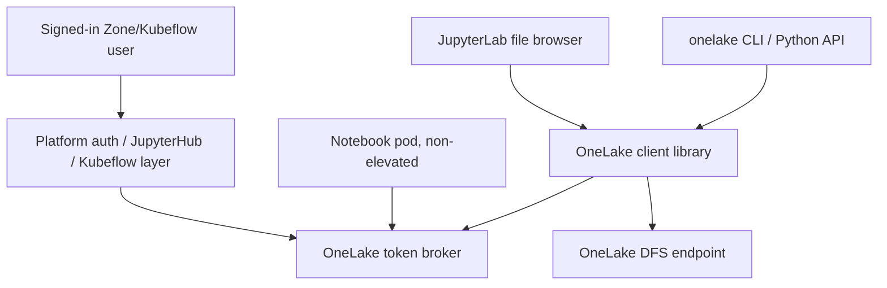

# OneLake Personal Drive Architecture Plan

## Executive Summary

This document defines a fresh, documentation-first architecture for OneLake access in Zone Kubeflow notebook containers. It replaces the previous BlobFuse2/FUSE-centered strategy with an API-backed **OneLake Personal Drive** model.

The core decision is:

- Do not use BlobFuse2/FUSE as the primary solution.
- Do not require `/dev/fuse`, `SYS_ADMIN`, privileged containers, or device-code authentication.
- Do not use a service principal, managed identity, or Workload Identity as the data-access identity for user files.
- Use the signed-in user's delegated Microsoft Entra identity through a platform token broker.
- Expose OneLake in JupyterLab through a Jupyter server drive/filesystem integration.
- Support cron jobs through a first-class `onelake` CLI and Python API.

The implementation branch must be created from `origin/beta`, not from the existing `beta-onelake-push` branch. This PR now contains the minimal image implementation as well as this architecture document.

## Branch And PR Strategy

Create a fresh branch from `origin/beta`:

```bash
git fetch origin beta
git worktree add ../zone-kubeflow-containers-onelake-architecture -b feat/onelake-personal-drive origin/beta
cd ../zone-kubeflow-containers-onelake-architecture
```

The current `beta-onelake-push` working tree contains untracked OneLake documentation and generated PDFs. Those files should not be carried into the fresh branch.

Current PR scope:

- Base branch is `origin/beta`.
- Branch name is `feat/onelake-personal-drive`.
- Add this architecture document.
- Add a dedicated `images/onelake` layer before `images/mid`.
- Add the API-backed Python helper, cron-friendly CLI, and JupyterLab file-browser resource.
- Add focused OneLake tests.
- No PDFs or generated artifacts.
- No BlobFuse2/FUSE implementation.

## Previous Context

The previous OneLake direction explored BlobFuse2 as a way to make OneLake appear as a mounted directory such as `~/onelake`.

That direction was attractive because it resembled the existing filer experience:

- Users could browse files in the JupyterLab left file explorer.
- Shell tools could use ordinary file paths.
- Notebook code could use paths such as `~/onelake/raw/file.csv`.
- The mount could persist across notebook restarts if configuration lived in the user's persistent home volume.

However, colleagues observed serious reliability issues when BlobFuse2 was used against OneLake:

- `ls` sometimes worked, sometimes took several minutes, and sometimes hung.
- `cat` sometimes worked, sometimes stalled, and sometimes made notebooks unresponsive.
- Arrow and Parquet operations were unreliable, even on small files.
- DVC workflows were unreliable.
- The same style of operations worked better when BlobFuse2 targeted ADLS directly instead of OneLake.

This suggests that the issue is not only BlobFuse2 itself. OneLake exposes ADLS Gen2-compatible APIs, but it is still a Microsoft Fabric logical data layer. A FUSE filesystem that translates POSIX calls into object/storage API calls is especially risky when tools expect local-disk semantics such as fast metadata operations, random reads, atomic rename behavior, file locking, and reliable append behavior.

Microsoft's BlobFuse2 and OneLake guidance also makes it clear that BlobFuse2 is not a complete POSIX filesystem replacement. That matters for notebook workloads because many common tools assume POSIX-like local filesystem behavior.

## Current Concerns

The BlobFuse2/FUSE approach conflicts with several business and platform constraints:

- FUSE commonly requires `/dev/fuse` in the container.
- FUSE may require extra container privileges such as `SYS_ADMIN`, unless the platform provides a device plugin or CSI-style solution.
- Elevated user containers introduce security risks.
- Device-code authentication is not acceptable.
- Service principal or Workload Identity access would use an application or managed identity, not the signed-in user's personal OneLake permissions.
- Azure CLI login inside a notebook container is not seamless and often implies device-code or user-managed auth.
- OneLake over BlobFuse2 has already shown unreliable behavior for important workflows.

The conclusion is that BlobFuse2 can be treated only as an experimental convenience, not as the platform's supported OneLake access model. For this project, it should be rejected as the primary path.

## Microsoft Consultant Follow-Up: Storage Containers And Shortcuts

A Microsoft consultant suggested using storage containers with shortcuts into OneLake. This is a viable **data layout** option, but it does not replace the OneLake Personal Drive architecture.

The distinction is:

- **OneLake Personal Drive** is the notebook access layer: delegated user auth, JupyterLab visibility, CLI/API access, cron support, and no elevated container.
- **Storage containers and OneLake shortcuts** are Fabric/OneLake data organization choices behind that access layer.

This means the current API-backed design is still the right foundation. The client already talks to OneLake through the ADLS Gen2-compatible DFS endpoint, so shortcuts that are present inside the configured lakehouse should appear as folders through the same `onelake ls`, JupyterLab drive, and API-backed read/write paths. No FUSE mount is needed for that.

What is not included in the first implementation:

- Creating shortcuts.
- Managing shortcut cloud connections.
- Owning Fabric shortcut lifecycle policy.
- Replacing the delegated user token broker with shortcut credentials.

Those shortcut-management responsibilities should be handled through Fabric platform workflows or a later platform-owned integration using the Fabric shortcut REST APIs.

Recommended shortcut posture:

| Option | Recommendation | Notes |
| --- | --- | --- |
| OneLake-to-OneLake shortcut | Preferred when possible | Microsoft documents passthrough behavior where the calling user's identity is used against the target OneLake location. |
| ADLS/Blob shortcut into OneLake | Viable after security review | Must confirm the shortcut's cloud connection/auth model still satisfies the requirement to respect the user's personal permissions. |
| Direct ADLS mount in notebook container | Still rejected | Does not provide the OneLake UI/API access model and commonly relies on storage/account/container identity rather than the signed-in user's OneLake authorization. |

Important behavior:

- Shortcuts appear as folders in OneLake and can be accessed by non-Fabric services through the OneLake API.
- Internal OneLake shortcuts should preserve user-permission checks against the target location.
- External shortcuts can involve cloud connections and delegated shortcut credentials, so they need explicit security review before being treated as compliant with the personal-permissions requirement.
- Deleting a shortcut object is different from deleting files inside a shortcut. Deleting files inside a shortcut can delete data in the target location if the caller is authorized.

Implementation impact:

- Keep `ONELAKE_WORKSPACE` and `ONELAKE_LAKEHOUSE` pointed at the lakehouse that exposes the desired files and shortcuts.
- For the first implementation, browse shortcuts created under the lakehouse `Files` area by using paths relative to the `Files` root, such as `<shortcut-name>/...`.
- Shortcuts under `Tables` can be added later as a deliberate extension if notebook file-browser access to table paths is required.
- Add shortcut validation to rollout testing: list a shortcut, read a small file through it, attempt a write only where explicitly authorized, and verify unauthorized targets fail closed.
- Do not add BlobFuse2, FUSE, elevated containers, device-code login, or service-account data access to support shortcuts.

## Business Requirements

The target solution must satisfy these requirements:

| Requirement | Required Outcome |
| --- | --- |
| OneLake visible in JupyterLab UI | Users can browse OneLake from the JupyterLab left file explorer. |
| Seamless user experience | Users do not run login commands, paste device codes, manage secrets, or configure Azure CLI. |
| Persistent between sessions | Workspace/lakehouse selection persists across notebook restarts. |
| No device-code authentication | Device-code login is not used anywhere in the supported flow. |
| User-specific permissions | OneLake access is evaluated as the signed-in user, not a service account. |
| Cron support | Cron jobs can read and write OneLake through a supported non-interactive CLI/API. |
| No elevated user container | User notebook containers do not require `SYS_ADMIN`, privileged mode, or `/dev/fuse`. |
| Limitations documented | Read, write, append, rename, delete, concurrent access, and tooling limitations are explicit. |

## Recommended Architecture

Use a **OneLake Personal Drive** backed by OneLake APIs rather than a Linux mount.

The architecture has four components:

1. Platform OneLake token broker.
2. Notebook OneLake client.
3. JupyterLab OneLake drive.
4. Cron-compatible OneLake CLI and Python API.



### Component 1: Platform Token Broker

The token broker is a platform service outside this image repository.

Responsibilities:

- Use the platform-authenticated user session.
- Exchange that user identity for a delegated OneLake/Storage access token.
- Return short-lived access tokens scoped for OneLake/ADLS Gen2 access.
- Fail closed when the user session is missing, expired, or not authorized.
- Avoid exposing refresh tokens, client secrets, or long-lived credentials to notebooks.
- Ensure the data-access identity remains the signed-in user.

The broker may use a Microsoft Entra app registration for the token exchange, but the app registration must not become the data-access identity. OneLake permissions must be evaluated against the user.

The broker is not a token that users provide and it is not a file stored in the notebook PVC. It is a small trusted service that mints or retrieves short-lived delegated OneLake access tokens on demand.

Recommended broker flow:

1. The notebook calls `GET /onelake/token`.
2. The broker authenticates the request using the platform-authenticated notebook session.
3. The broker performs a Microsoft Entra delegated token flow for the signed-in user.
4. The broker requests a Storage-audience token for OneLake.
5. The broker returns only a short-lived bearer token to the notebook client.
6. The notebook client passes that token to the Azure Data Lake SDK in memory.

The notebook image must not store:

- OneLake access tokens.
- Refresh tokens.
- Microsoft Entra client secrets.
- Service principal credentials.
- User passwords.

If the platform needs a credential for the notebook to call the broker, it should be an opaque broker-audience session credential, not a OneLake/Storage token. The preferred injection pattern is a short-lived file mounted outside the persistent home directory and referenced by:

```text
ONELAKE_BROKER_TOKEN_FILE
```

That file, when used, is only for authenticating to the broker. It is not a OneLake token and must not grant direct data access.

Expected token audience/scope:

```text
https://storage.azure.com/.default
```

Expected OneLake endpoint:

```text
https://<region>-onelake.dfs.fabric.microsoft.com
```

For the Government of Canada deployment, the endpoint must be the regional OneLake DFS endpoint for the Fabric capacity that owns the workspace. The image default is currently:

```text
https://canadacentral-onelake.dfs.fabric.microsoft.com
```

If the Fabric capacity is in another Canadian region, the platform must set `ONELAKE_REGION` or `ONELAKE_ENDPOINT` accordingly. The global endpoint `https://onelake.dfs.fabric.microsoft.com` must not be used for production GoC data access because Microsoft documents a data-residency risk during global endpoint resolution, and some operations such as `Get User Delegation Key` require the regional endpoint from Fabric workloads.

### Component 2: Notebook OneLake Client

The notebook image owns a small OneLake client library.

Responsibilities:

- Read non-secret configuration from environment variables and user config files.
- Ask the token broker for delegated user tokens.
- Allow a temporary manual delegated access token only for initial smoke testing, without persisting it.
- Use OneLake's ADLS Gen2-compatible DFS APIs.
- Provide a stable Python API for notebooks, cron jobs, and the JupyterLab drive backend.
- Never require Azure CLI login.
- Never call device-code login.
- Never store secrets in the user PVC.

Required environment variables:

| Variable | Purpose |
| --- | --- |
| `ONELAKE_BROKER_URL` | Base URL for the platform token broker. Required for the production architecture. |
| `ONELAKE_WORKSPACE` | Optional default Fabric workspace name or GUID. |
| `ONELAKE_LAKEHOUSE` | Optional default lakehouse name or GUID. |

Optional environment variables:

| Variable | Purpose |
| --- | --- |
| `ONELAKE_REGION` | Fabric capacity region used to build the regional DFS endpoint. Defaults to `canadacentral`. |
| `ONELAKE_ENDPOINT` | Full regional OneLake DFS endpoint override. Defaults to `https://canadacentral-onelake.dfs.fabric.microsoft.com`. |
| `ONELAKE_CONFIG` | Optional override for the config path. |
| `ONELAKE_BROKER_TOKEN_PATH` | Optional broker token path appended to `ONELAKE_BROKER_URL`. Defaults to `/onelake/token`. |
| `ONELAKE_BROKER_TOKEN_FILE` | Optional path to an opaque platform session credential for calling the broker. |
| `ONELAKE_ALLOW_INSECURE_BROKER` | Dev-only opt-in for HTTP broker URLs when testing against an in-cluster service. Production broker URLs must use HTTPS or a localhost sidecar. |
| `ONELAKE_ACCESS_TOKEN` | Temporary manual delegated OneLake token for one-off smoke tests only. Not saved by the client. |
| `ONELAKE_ACCESS_TOKEN_FILE` | Temporary file containing a manual delegated token for smoke tests. Must be outside the persistent home PVC. |

Default persisted config path:

```text
~/.onelake/config.json
```

Example config:

```json
{
  "workspace": "workspace-guid-or-name",
  "lakehouse": "lakehouse-guid-or-name"
}
```

No access tokens, refresh tokens, client secrets, or service principal credentials are written to this file.

Temporary manual-token test path:

- The production path remains `ONELAKE_BROKER_URL`.
- A manually supplied token must be a short-lived delegated user token for `https://storage.azure.com/.default`.
- The image never writes that token to `~/.onelake/config.json`.
- For CLI-only tests, prefer piping the token with `onelake --access-token-stdin ...` so the token is held only in that process.
- For JupyterLab file-browser tests before the broker exists, the Jupyter server process can receive `ONELAKE_ACCESS_TOKEN` or `ONELAKE_ACCESS_TOKEN_FILE`; this is explicitly a pilot-only bridge and should be removed once the broker/app-registration flow is ready.

Dev AuthService smoke-test path:

The current dev AuthService endpoint can be used as a broker compatibility path without copying its code into this repo. For OneLake file browsing through the ADLS/DFS APIs, request a Storage-audience token, not a Fabric REST API token:

```text
https://storage.azure.com/.default
```

Fabric REST API calls, such as listing workspaces through `https://api.fabric.microsoft.com/v1/`, use Fabric scopes such as `https://api.fabric.microsoft.com/Workspace.ReadWrite.All` or `https://api.fabric.microsoft.com/.default`. Those tokens are not accepted by OneLake DFS file APIs.

In a dev notebook pod, configure the client like this:

```bash
export ONELAKE_BROKER_URL=http://authservice.kubeflow.svc.cluster.local:8080/authservice
export ONELAKE_BROKER_TOKEN_PATH=/getToken
export ONELAKE_ALLOW_INSECURE_BROKER=true
export ONELAKE_WORKSPACE=<workspace-name-or-guid>
export ONELAKE_LAKEHOUSE=<lakehouse-name-or-guid>

onelake doctor --live
onelake ls /
```

If the broker returns `AADSTS65001` or `consent_required` for `https://storage.azure.com/.default`, the code path is wired but the Entra app registration still needs consent for the downstream Storage resource. That consent must be handled in the app registration or tenant consent flow before OneLake DFS access can succeed.

### Component 3: JupyterLab OneLake Drive

The JupyterLab integration must make OneLake visible in the file browser without using a kernel mount.

Recommended implementation:

- Use a Jupyter server drive/filesystem integration such as `jupyter-fs` with a small custom fsspec-compatible OneLake backend, or a focused Jupyter ContentsManager/drive extension if `jupyter-fs` cannot satisfy the UX.
- Register a visible drive/resource named `OneLake`.
- Back all operations with the notebook OneLake client.

Supported user-facing operations:

| Operation | Behavior |
| --- | --- |
| Browse/list | List directories and files through OneLake APIs. |
| Open/read | Read file contents through OneLake APIs. |
| Save/write | Upload complete file contents through OneLake APIs. |
| Upload | Upload local browser-selected files to OneLake. |
| Download | Download OneLake files through JupyterLab. |
| Mkdir | Create directories where OneLake APIs support it. |
| Rename | Use OneLake/ADLS rename semantics where supported. |
| Delete | Delete files/directories where supported and authorized. |

The JupyterLab drive is not a POSIX filesystem. It is a UI and server API integration.

### Component 4: Cron-Compatible CLI And Python API

Cron support is delivered through a supported command-line interface and Python API, not through POSIX paths.

Required commands:

```bash
onelake status
onelake configure <workspace> <lakehouse>
onelake ls [path]
onelake cat <path>
onelake cp onelake:<path> <local-path>
onelake cp <local-path> onelake:<path>
onelake append <path>
```

Cron examples:

```bash
# Download input, process locally, upload output.
onelake cp onelake:raw/input.csv /tmp/input.csv
python /home/jovyan/jobs/process.py /tmp/input.csv /tmp/output.csv
onelake cp /tmp/output.csv onelake:processed/output.csv
```

```bash
# Append a log line through the supported API.
printf '%s\n' "job completed at $(date -Iseconds)" | onelake append logs/cron.log
```

Cron jobs run as the notebook user and use the same broker-backed delegated identity path. They do not run `az login`, do not use device code, and do not need elevated container permissions.

Headless cron auth decision:

- In this image, cron means jobs running inside an active notebook pod, not indefinite background jobs after the user session has ended.
- Production cron access requires one of two platform auth patterns: a refreshed broker-audience session credential mounted at `ONELAKE_BROKER_TOKEN_FILE`, or a localhost broker sidecar/proxy that can refresh delegated user tokens while the user's platform session remains valid.
- When the platform session expires and neither pattern can refresh it, cron commands must fail closed with 401 rather than silently switching to app-only access.
- Fully unattended or long-running jobs beyond the user's active delegated session should be moved to a platform job service with an explicit identity and authorization model, not hidden inside the notebook container.

## Requirement Compliance Matrix

| Requirement | Design Choice | Status |
| --- | --- | --- |
| Visible in JupyterLab UI | JupyterLab `OneLake` drive/resource backed by API calls. | Satisfied |
| Seamless access | Platform broker uses existing authenticated user session. | Satisfied, depends on platform integration |
| Persistent between sessions | Store workspace/lakehouse config in `~/.onelake/config.json`. | Satisfied |
| No device code | Remove device-code login from supported flow. | Satisfied |
| User permissions | Broker returns delegated user token; OneLake evaluates user identity. | Satisfied |
| Cron support | `onelake` CLI/Python API for jobs in an active notebook pod, with refreshed broker session credential or localhost broker sidecar. | Satisfied with platform auth wiring |
| No elevated container | No FUSE, no BlobFuse2, no `/dev/fuse`, no `SYS_ADMIN`. | Satisfied |
| Limitations documented | This document defines limitations and workarounds. | Satisfied |

## Notebook Readiness And Smoke Testing

The notebook image can be tested without any FUSE option enabled. Users should not click any OneLake FUSE mount setting for this architecture.

The image is correctly wired when:

- The `onelake` command exists.
- The OneLake Python modules and dependencies import successfully.
- The JupyterLab file browser shows a `OneLake` resource.
- `ONELAKE_WORKSPACE` and `ONELAKE_LAKEHOUSE` are present, or workspace/lakehouse were saved with `onelake configure`.
- `ONELAKE_BROKER_URL` is present for production access, or a temporary manual delegated token is present for the initial pilot smoke test only.

Important auth distinction:

- Users do not manually manage access tokens in the supported production flow.
- The platform still must provide a delegated user-token path through `ONELAKE_BROKER_URL`.
- Without that broker path or an explicitly temporary manual delegated token, live OneLake access must fail closed because the notebook has no compliant way to prove the signed-in user's identity to OneLake.
- `ONELAKE_BROKER_TOKEN_FILE`, if used, is only a broker-auth credential. It is not a OneLake data token and should not live in the persistent home volume.
- `ONELAKE_ACCESS_TOKEN` and `ONELAKE_ACCESS_TOKEN_FILE`, if used, are pilot-only direct OneLake access tokens. They must not be checked into code, written to the home PVC, logged, or used as the long-term architecture.

Notebook smoke test:

```bash
onelake status
onelake doctor
onelake doctor --live
onelake ls /
```

One-off CLI smoke test with a pasted token:

```bash
read -rsp "OneLake access token: " ONELAKE_TOKEN
printf '%s' "$ONELAKE_TOKEN" | onelake --access-token-stdin doctor --live
unset ONELAKE_TOKEN
```

Expected outcomes:

| Result | Meaning |
| --- | --- |
| `onelake doctor` reports missing auth path | Image is present, but broker wiring or a temporary manual token is not available. |
| `onelake doctor --live` returns 401 | Broker/session wiring exists but the user session is unavailable or expired. |
| `onelake doctor --live` returns 403 | Auth is working, but the signed-in user lacks permission to the configured workspace/lakehouse/path. |
| `onelake doctor --live` succeeds | CLI/API path is ready for notebook and cron testing. |

## Rejected Options

### BlobFuse2 In The User Container

Rejected as the primary solution.

Reasons:

- Requires FUSE-style mounting.
- Often needs `/dev/fuse`, `SYS_ADMIN`, privileged mode, or platform device support.
- Observed OneLake behavior was unreliable for `ls`, `cat`, Arrow, and DVC.
- Not fully POSIX-compliant.
- Hard to satisfy delegated user auth cleanly without local user auth state or device-code-style flows.

### ADLS Direct Mount

Rejected as the primary solution.

Reasons:

- ADLS may behave better than OneLake with BlobFuse2, but the requirement is OneLake access.
- Direct ADLS mount identity is usually a storage account credential, SAS, service principal, managed identity, or CSI-level identity.
- That does not naturally enforce the signed-in user's personal OneLake permissions.
- It also does not solve the JupyterLab, token delegation, and user-permission requirements as a single clean product path.

This rejection does not reject ADLS or Blob shortcuts inside OneLake. Shortcuts are acceptable when exposed through the OneLake API and when their security model satisfies the signed-in user permission requirement.

### Service Principal Or Workload Identity For User Data Access

Rejected for user data access.

Reasons:

- Data access would be evaluated as the app or managed identity.
- The business requirement explicitly says the mounted/accessed OneLake spaces must respect the user's own personal account permissions.
- Service principals may still be useful for the token broker infrastructure, but not as the identity used to read and write user OneLake files.

### Azure CLI Login Or Device Code

Rejected.

Reasons:

- Device-code authentication is explicitly disallowed.
- Azure CLI auth places authentication burden on users.
- Azure CLI auth state inside notebook containers is brittle for cron and persistence.

### User-Provided Bearer Tokens Or SAS As Primary Auth

Rejected as the primary solution.

Reasons:

- Users should not paste or manage OneLake bearer tokens.
- User-provided tokens would not be seamless and would create support and leakage risk.
- OneLake SAS can be useful for short-lived delegated compatibility with tools that do not support Microsoft Entra auth, but it should not be the default notebook/JupyterLab/cron auth path.
- The supported path remains broker-provided delegated user access tokens handled in memory by the client.

Temporary exception:

- A manually pasted delegated bearer token is acceptable only for the initial pilot smoke test before the broker/app-registration path is available.
- The token is accepted through `onelake --access-token-stdin`, `ONELAKE_ACCESS_TOKEN`, or an ephemeral `ONELAKE_ACCESS_TOKEN_FILE`.
- This exception must not persist tokens in `~/.onelake/config.json`, notebook files, image layers, GitHub Actions logs, or the user's persistent home volume.

## Implementation Status And Gap Analysis

| Phase | Current Status | Remaining Gap |
| --- | --- | --- |
| Phase 1: Architecture document | Complete in this PR. | None for this repo. |
| Phase 2: Platform token broker contract | Contract is documented and the client is wired to call it with in-memory token caching. | The actual broker service, session validation, cron refresh pattern, and pod/env injection must be implemented by the platform layer outside this repo. |
| Phase 3: Minimal OneLake client and CLI | Complete for lakehouse `Files` paths: `status`, `doctor`, `configure`, `ls`, `cat`, `cp`, and `append`. | Broker-backed live access still depends on platform/env injection; temporary manual-token smoke testing is available only as a bridge. Regional endpoint must match the Fabric capacity before production. |
| Phase 4: JupyterLab drive | Wired with `jupyter-fs` and a custom fsspec backend named `OneLake`. | Needs manual UI validation in a built notebook image against a real broker-backed session or temporary manual delegated token. |
| Phase 5: Docs, tests, rollout | Focused docs and tests are included. | Pilot rollout, shortcut live testing, and legacy FUSE UI removal are platform/UI follow-ups. |

Notable non-repo dependencies:

- A platform-owned token broker.
- A platform-owned way to inject `ONELAKE_BROKER_URL`, default workspace/lakehouse values, the correct regional OneLake endpoint, and optional broker session credential.
- A platform-owned cron refresh decision: refreshed `ONELAKE_BROKER_TOKEN_FILE`, localhost sidecar/proxy, or active-session-only cron.
- Replacement of temporary manual-token testing with the app-registration-backed delegated broker flow.
- Removal of any legacy "Enable OneLake FUSE mount" notebook UI option wherever that UI is defined.
- A real Fabric workspace/lakehouse and user permissions for live testing.

## Implementation Phases

### Phase 1: Architecture Foundation

Goal:

- Establish the architecture decision and implementation direction.

Changes:

- Add `docs/onelake-architecture-plan.md`.
- No generated PDFs.

Acceptance:

- Reviewers can validate the business requirements, architecture, rejected options, phased plan, and implementation boundaries.

### Phase 2: Platform Token Broker Contract

Goal:

- Define the platform boundary required for delegated user auth.

Deliverables:

- Broker API contract.
- Required env vars and injected pod/session credential mechanism.
- Regional endpoint selection based on the Fabric capacity region.
- Cron refresh policy for notebook-pod cron jobs.
- Error behavior for expired sessions, missing permissions, and unavailable broker.
- Security review of token lifetime and logging.
- Confirmation that no OneLake access token, refresh token, or client secret is stored in the notebook PVC.
- Confirmation that the broker uses delegated user identity, such as Microsoft Entra on-behalf-of flow, rather than app-only data access.

Minimum broker API:

```http
GET /onelake/token
```

The endpoint must require platform session authentication. It should not be anonymously callable from arbitrary pods. Acceptable request authentication patterns include:

- A platform reverse proxy that injects and validates the signed-in user session.
- A short-lived opaque broker-audience token mounted at `ONELAKE_BROKER_TOKEN_FILE`.
- A local sidecar reachable only through `http://localhost` that already has platform-authenticated user context.

The image client rejects non-HTTPS broker URLs except localhost sidecar URLs unless `ONELAKE_ALLOW_INSECURE_BROKER` is explicitly enabled for an in-cluster dev smoke test. Production broker URLs should use HTTPS.

Expected successful response:

```json
{
  "access_token": "<short-lived delegated token>",
  "expires_on": 1770000000,
  "token_type": "Bearer"
}
```

Token lifetime and caching requirements:

- The broker should return a Storage-audience delegated token with roughly the upstream Microsoft Entra access-token lifetime, normally about 60 minutes.
- The minimum acceptable remaining TTL is 30 minutes. The image client rejects broker responses below that threshold because short TTLs would force frequent broker calls under interactive JupyterLab browsing.
- `expires_on` must be a Unix epoch timestamp in seconds so the client can cache the `AccessToken` safely.
- The notebook client caches broker tokens in memory until five minutes before expiry and reuses a single broker HTTP session.
- The broker may cache tokens server-side, but that cache must live in the platform service, be encrypted according to platform standards, and be keyed to the signed-in user/session.

The response must not include a refresh token. The notebook image treats returned access tokens as in-memory credentials only.

For compatibility with the current dev AuthService endpoint, the image client also accepts a raw `text/plain` bearer token response from `ONELAKE_BROKER_TOKEN_PATH=/getToken`. The JSON shape above remains the production broker contract because it carries explicit expiry metadata for predictable client-side caching.

Expected failure modes:

| Condition | Behavior |
| --- | --- |
| Missing user session | Return 401. |
| User lacks OneLake permission | Return 403 or allow OneLake API to return 403. |
| Broker unavailable | Client reports auth unavailable and fails closed. |
| Token exchange fails | Client reports token acquisition failure without leaking secrets. |

### Phase 3: Minimal OneLake Client And CLI

Goal:

- Provide programmatic and cron access through OneLake APIs.

Image repo changes:

- Keep changes isolated to the existing OneLake image layer.
- Replace BlobFuse2-centered assumptions with broker-backed API access.
- Add an `onelake` CLI.
- Keep the Python helper API simple and stable.

Python helper target API:

```python
import onelake_utils as onelake

onelake.info()
onelake.configure("workspace", "lakehouse")
onelake.ls("/")
onelake.read("raw/input.csv", as_text=True)
onelake.write("processed/output.txt", "done\n")
onelake.download("raw/input.csv", "/tmp/input.csv")
onelake.upload("/tmp/output.csv", "processed/output.csv")
onelake.append("logs/job.log", "completed\n")
```

CLI target API:

```bash
onelake status
onelake configure <workspace> <lakehouse>
onelake ls /
onelake cat raw/input.csv
onelake cp onelake:raw/input.csv /tmp/input.csv
onelake cp /tmp/output.csv onelake:processed/output.csv
onelake append logs/job.log
```

### Phase 4: JupyterLab Drive

Goal:

- Make OneLake visible in the JupyterLab left file explorer.

Implementation preference:

- First evaluate `jupyter-fs` with a custom fsspec-compatible backend.
- Use a custom Jupyter ContentsManager/drive extension only if `jupyter-fs` cannot provide the needed UX or auth integration.

Behavior:

- A `OneLake` entry appears in the JupyterLab file browser.
- If not configured, the drive shows a clear non-secret setup/status message.
- Operations use the same OneLake client and broker path as the CLI.
- No Linux mount is created.

### Phase 5: Documentation, Tests, And Rollout

Goal:

- Replace BlobFuse2/FUSE guidance with the supported API-backed path.

Documentation updates:

- User guide: how to browse in JupyterLab and use the `onelake` CLI.
- CLI guide: cron examples and local-staging workflows.
- Technical reference: auth broker, API-backed drive, limitations.

Test updates:

- Unit tests for config loading and path construction.
- Unit tests for broker token retrieval with mocked responses.
- Unit tests for CLI commands.
- Smoke test for JupyterLab drive registration.
- Smoke test for pre-existing OneLake shortcuts exposed through the configured lakehouse.
- Regression checks that device-code/BlobFuse2/FUSE assumptions are removed.

Rollout:

- Ship behind a feature flag or image tag first.
- Pilot with a small group.
- Collect failures around auth, permissions, listing latency, upload/download behavior, and JupyterLab UX.
- Promote only after user-permission and cron workflows are validated.

## Limitations And Workarounds

This section is part of the supported user contract.

### Not A POSIX Filesystem

The OneLake Personal Drive is not a Linux filesystem mount.

Implications:

- `~/onelake/file.csv` is not guaranteed and is not part of the supported contract.
- Shell tools should use the `onelake` CLI.
- Code requiring local paths should stage files locally first.

Workaround:

```bash
onelake cp onelake:raw/data.csv /tmp/data.csv
python analysis.py /tmp/data.csv
onelake cp /tmp/result.csv onelake:processed/result.csv
```

### Reads

Supported:

- Full-file reads.
- Download to local files.
- JupyterLab open/download.
- SDK reads for Python workflows.

Use local staging for:

- Large files.
- Tools that perform many random reads.
- Arrow/Parquet readers that behave poorly against remote filesystems.
- DVC workflows that expect local filesystem semantics.

### Writes

Supported:

- Full-file overwrite through API upload.
- Upload local file to OneLake.
- JupyterLab save/upload where file size and API behavior are acceptable.

Avoid:

- Multiple writers to the same path.
- Workflows that rely on atomic local rename behavior.
- Treating OneLake as a scratch disk.

Recommended pattern:

- Write outputs locally.
- Upload final artifacts to unique OneLake paths.

### Appends

Supported:

- Append through an explicit CLI/API append operation.

Not supported:

- Arbitrary local file-handle append behavior.
- Multiple concurrent appenders to the same file.

Recommended pattern:

- Use unique log files per job/run when possible.
- For shared logs, use a single writer or application-level coordination.

### Rename, Delete, And Locking

Behavior follows OneLake/ADLS Gen2 API semantics, not local POSIX semantics.

Implications:

- Locking should not be assumed.
- Atomic multi-step filesystem workflows should be avoided.
- Concurrent writers should coordinate outside OneLake.

### Tooling Guidance

| Tooling | Recommended Pattern |
| --- | --- |
| JupyterLab browsing | Use the OneLake drive. |
| Python scripts | Use `onelake_utils` or local staging. |
| Cron jobs | Use the `onelake` CLI. |
| pandas | Use local staging or direct API/fsspec access after validation. |
| Arrow/Parquet | Prefer local staging for reliability. |
| DVC | Avoid the OneLake drive as a DVC filesystem backend unless a proper remote driver is validated. |
| R | Use local staging or reticulate/Python helper until a native R helper is added. |
| Shell tools | Use `onelake cat`, `onelake cp`, or staged local files. |

## Security Model

Security goals:

- User data access is delegated to the signed-in user.
- No long-lived credentials in notebook containers.
- No service-account data access.
- No device-code login.
- No elevated user container.
- No token logging.

Controls:

- Broker returns short-lived tokens only.
- Client stores only non-secret workspace/lakehouse configuration.
- Logs redact authorization headers and token values.
- Broker fails closed.
- User permissions are enforced by OneLake/Fabric using the delegated user identity.

## Minimal Change Strategy

The implementation should be surgical:

- Keep the existing image build chain.
- Keep OneLake work in the `images/onelake` layer.
- Do not refactor unrelated `mid`, `sas_kernel`, `jupyterlab`, or `sas` layers.
- Do not alter PDF generation in the first PR.
- Avoid broad dependency churn.
- Add the smallest possible Jupyter integration that makes OneLake visible in the file browser.
- Add tests close to the changed OneLake code.

## References

- OneLake API access: https://learn.microsoft.com/en-us/fabric/onelake/onelake-access-api
- OneLake shortcuts: https://learn.microsoft.com/en-us/fabric/onelake/onelake-shortcuts
- OneLake shortcut security: https://learn.microsoft.com/en-my/fabric/onelake/onelake-shortcut-security
- OneLake shared access signatures: https://learn.microsoft.com/en-us/fabric/onelake/onelake-shared-access-signature-overview
- Fabric shortcut REST API: https://learn.microsoft.com/en-us/rest/api/fabric/core/onelake-shortcuts/create-shortcut
- OneLake BlobFuse2 guidance: https://learn.microsoft.com/en-us/fabric/onelake/mount-onelake-with-blobfuse
- OneLake API parity and limitations: https://learn.microsoft.com/en-us/fabric/onelake/onelake-api-parity
- Microsoft identity platform on-behalf-of flow: https://learn.microsoft.com/en-us/entra/identity-platform/v2-oauth2-on-behalf-of-flow
- JupyterLab services and contents APIs: https://jupyterlab.readthedocs.io/

## Final Decision

Proceed with a OneLake Personal Drive architecture:

- API-backed JupyterLab visibility.
- Delegated user auth through a platform token broker.
- CLI/API-based cron support.
- No BlobFuse2/FUSE primary path.
- No device-code authentication.
- No elevated user container.
- No service-account data identity.

This is the cleanest path that satisfies the business requirements while avoiding the reliability and security problems found in the BlobFuse2 approach.
