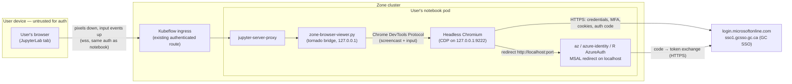

# Zone Browser — security architecture

*Prepared for Cybersecurity review of the device-code authentication
retirement. Code: [`images/mid/zone-browser/`](../images/mid/zone-browser/).*

## Executive summary

Device-code authentication is being retired because the grant is phishable.
The Zone Browser removes the Zone's dependency on it **without weakening the
controls that motivated the retirement**: a headless Chromium runs *inside*
the user's notebook pod, so `az login`, Python `azure-identity`, and R
`AzureAuth` (including in RStudio) complete the **standard interactive
authorization-code flow** on the StatCan network. The user sees and drives
the sign-in page as a tab inside JupyterLab, but their local browser only
ever displays pixels — **credentials, cookies, and tokens exist solely
inside the pod's browser talking directly to Microsoft / GC SSO**. Users
change nothing: no wrappers, no code changes, no device codes.

## Why device code is phishable — and why this design is not

The device-code grant decouples *where the flow starts* from *where the user
authenticates*: an attacker can initiate `az login --use-device-code`
themselves and social-engineer a victim into entering the code at
`microsoft.com/devicelogin` on the victim's own trusted browser. The
attacker's session then receives the victim's tokens. The user-typeable code
**is** the vulnerability.

The Zone Browser uses the authorization-code flow with a `localhost`
redirect, with these properties:

- **There is no code for a victim to enter anywhere.** Nothing about the
  flow can be forwarded, relayed, or read out over the phone.
- **The flow starts and completes in the same process space.** MSAL's
  redirect listener binds to `localhost` inside the pod; only the browser in
  that same pod can complete it. An attacker cannot initiate a flow whose
  tokens land somewhere the victim can't see.
- **The URL bar is visible and read-only in the viewer**, so users verify
  they are on `login.microsoftonline.com` / `sso1.gcsso.gc.ca` before typing
  credentials — unlike device code, where the prompt arrives contextless.
- **Sign-in egress originates from the pod** (StatCan network), so
  location-based Conditional Access evaluates the true workload location,
  not a home network.

## Architecture



Plain-text version:

```
user's browser tab  ──wss (authenticated notebook route)──►  jupyter-server-proxy
                                                                    │
                                            zone-browser-viewer.py (127.0.0.1)
                                                                    │  CDP: JPEG frames out,
                                                                    │  mouse/keys in
                                            Headless Chromium (127.0.0.1:9222)
                                              │                      ▲
                          HTTPS: credentials, │                      │ redirect to
                          MFA, cookies        ▼                      │ http://localhost:<port>
                        login.microsoftonline.com / gcsso.gc.ca      │
                                              ▲                      │
                                              └── token exchange ── az login (MSAL, in-pod)
```

## Trust boundaries and what crosses them

| Boundary | What crosses it | What never crosses it |
|---|---|---|
| User device ⇄ cluster | JPEG frames of the browser screen (down); mouse/keyboard events (up); all over the notebook's existing authenticated HTTPS/WSS route | Credentials, session cookies, tokens, sign-in page DOM |
| Pod ⇄ Microsoft/GC SSO | The TLS sign-in session (credentials, MFA, cookies, auth code) — direct from the pod's Chromium | — |
| Inside the pod | CDP between viewer and Chromium; MSAL's localhost redirect | — (all loopback, `127.0.0.1` only) |

The user's keystrokes for their password *do* transit the first boundary as
input events — over the same authenticated, TLS-protected channel that
already carries everything they type into a terminal or notebook. Anyone
who could intercept that channel already owns the user's entire workspace
session; the Zone Browser adds no new exposure.

## Controls

- **No new network surface.** Chromium's DevTools port and the viewer bind
  to `127.0.0.1`. The only external path is the pre-existing, authenticated
  `jupyter-server-proxy` route. No new Service, ingress, port, or
  NetworkPolicy.
- **No X server, no VNC.** Screen transport is the Chrome DevTools Protocol
  through the notebook server; there is no remote-desktop stack to harden.
- **Ephemeral browser state.** The Chromium profile lives under `/tmp`
  (never the home PVC) and an idle watchdog terminates the browser after 15
  minutes without use; the next sign-in starts it fresh. Long-lived
  credentials are held where they always were (`~/.azure`, MSAL cache), with
  unchanged semantics.
- **TLS inspection compatible.** StatCan CA certificates are imported into
  Chromium's trust store on first use, so inspected egress verifies cleanly.
- **`--no-sandbox` with compensating controls.** The pod's seccomp profile
  does not permit Chromium's sandbox syscalls. The browser is headless, runs
  as the unprivileged notebook user, inside the pod's own isolation
  boundary, and its intended use is first-party sign-in pages. This is the
  standard posture for browsers in containers (the pod *is* the sandbox).
- **No printed links.** The terminal banner deliberately contains no URL, so
  nothing routes users to their local browser; the JupyterLab tab opens
  automatically instead.

## Considerations for the review

1. **Conditional Access:** the pod is not an Intune-enrolled device. If a
   policy for these apps requires *device compliance* (rather than trusted
   network/location), it would block this flow — as it would any in-pod
   flow. Confirmation requested that CA for the affected apps is
   location/network-based.
2. **Egress:** rendering the sign-in pages in-pod requires egress to
   Microsoft's sign-in CDNs (`aadcdn.msauth.net`, `aadcdn.msftauth.net`) and
   `sso1.gcsso.gc.ca` in addition to `login.microsoftonline.com` (which
   device-code already required). To reduce that CDN dependence, the
   launcher appends `domain_hint=statcan.gc.ca` to Entra authorize URLs
   (`ZONE_BROWSER_DOMAIN_HINT`): Entra then answers with a plain HTTP 302
   straight to GC SSO, so the CDN-rendered account-picker/discovery pages
   are never loaded on the critical path. This is Entra's documented Home
   Realm Discovery auto-acceleration; it adds no scopes, apps or endpoints.
3. **General-purpose browsing:** the in-pod browser can technically render
   any URL the pod can reach — the same reachability a user already has via
   `curl`/`requests` from a terminal. Existing egress policy remains the
   control; the browser does not expand it.

## Flow comparison

| | Device code (retiring) | Interactive on user device | **Zone Browser** |
|---|---|---|---|
| Phishable user-enterable code | **Yes** | No | No |
| Where credentials are typed | User's browser, contextless prompt | User's browser | Pod browser, URL visible |
| Sign-in egress source | User device | User device | **Pod / StatCan network** |
| Grant type | `device_code` | auth code + PKCE | auth code + PKCE |
| User code changes needed | — | n/a (no browser in pod) | **None** |

## Validation status

- Local end-to-end (Ubuntu 24.04 harness): real `az login` → tab auto-opens
  in JupyterLab → Microsoft sign-in renders → typing/clicking forwarded →
  federation redirect to the real `sso1.gcsso.gc.ca` ADFS page confirmed.
- R: `options(browser)` override verified in R 4.4 including a simulated
  RStudio session-init sequence.
- CI: full image pipeline green (build, in-image selftest, downstream
  images).
- Pending: full sign-in with production credentials from an in-cluster
  beta notebook (validates egress + Conditional Access posture).
